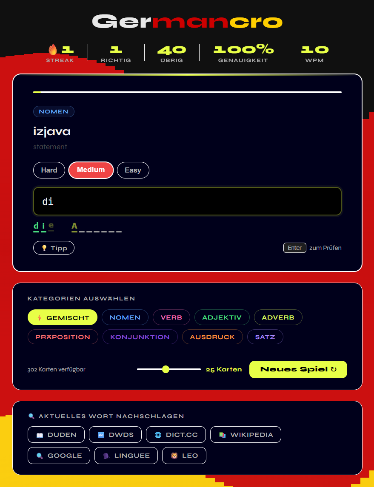

# 🇩🇪 GermanCro

**GermanCro** is a small vocabulary training app for learning **German** using
**English prompts** and **Croatian context** as support.

It’s inspired by [elon.io](https://elon.io) and focuses on accurate, practical vocabulary.

---

## 🚀 How to Run

The app loads data from `cards.json`, so it needs a local server.

```bash
npx serve .
```

Open the shown `localhost` link in your browser.

---

## 🧠 How It Works

1. You see an **English word or phrase**
2. A **Croatian translation** is shown as a hint
3. You type the **German translation** into the grid

This helps reduce ambiguity and improves retention.

---



---

## ✨ Features

* **230+ vocabulary cards**

  * Engineering
  * Methodology
  * Argumentation
  * Description
  * Soft skills

* **Live character grid**

  * Correct letters lock in
  * Punctuation is filled automatically

* **Progress stats**

  * Accuracy
  * Streak
  * WPM

* **Hints**

  * Reveal 3 letters at a time

* **Category selection**

  * Practice one topic or mix all

---

## 📂 Project Structure

```id="tree1"
index.html   # UI and category selector
style.css    # Styling and layout
app.js       # App logic and scoring
cards.json   # Vocabulary (DE / EN / HR)
```

---

## 📝 Notes

* Fully client-side
* Easy to extend by editing `cards.json`
* Strict spelling is intentional