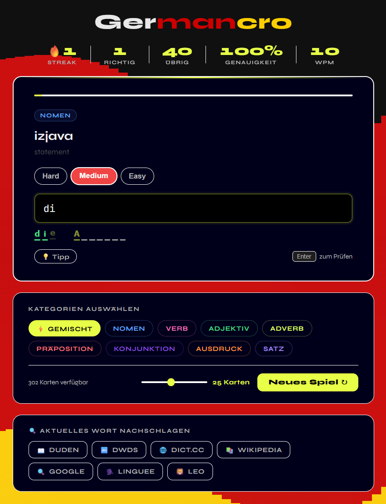

# GermanCro

GermanCro is a browser-based German trainer with Croatian and English support. The learner sees two prompt languages, types the German answer, and gets live character-by-character feedback.

## Current card model

The vocabulary deck now uses a structured card schema:

```json
{
  "de": "das Auto",
  "hr": "auto",
  "en": "car",
  "topic": "vehicles",
  "subcategory": "Nomen",
  "scope": "all"
}
```

Field meanings:

- `de`: German answer the learner types
- `hr`: Croatian prompt
- `en`: English support gloss
- `topic`: top-level content group used for session filtering
- `subcategory`: grammar or content type shown on the card badge
- `scope`: card availability mode

Current built-in topics:

- `basics`
- `vehicles`
- `nature`
- `food`
- `travel`
- `work`
- `health`
- `people`
- `shopping`
- `developertech`
- `itnetwork`

Current subcategories:

- `Nomen`
- `Verb`
- `Adjektiv`
- `Adverb`
- `Präposition`
- `Konjunktion`
- `Ausdruck`
- `Satz`

Current scopes:

- `all`: shared card for all three learning modes
- `de`: DE-mode specific
- `hr`: HR-mode specific
- `gb`: GB-mode specific

The shipped starter deck currently contains 659 cards across eleven built-in topics, mostly shared and a few DE-mode-specific.

## Quick start

Serve the app over HTTP from the repo root:

```bash
npx serve .
```

Open the local URL shown by the server.

If you want direct writes from the add-card panel, run the local Node server:

```bash
npm start
```

That enables `POST /api/cards` and writes to `cards.user.json`.

## Repo map

```text
index.html        App structure and form controls
style.css         Visual design and responsive layout
app.js            Session flow, filters, authoring UI, and card validation
cards.json        Main vocabulary dataset
cards.user.json   Optional local extension dataset
locales.json      UI labels for topics, subcategories, and scopes
server.js         Local editable server and save API
MAINTAINING.md    Maintainer workflow and change checklist
USER_GUIDE.md     End-user guide for the interface
```

## Adding cards

Use the `Neue Karte hinzufügen` panel in the app and fill in:

- `Topic`: top-level filter group such as `basics`, `developertech`, or `itnetwork`
- `Subcategory`: `Nomen`, `Verb`, `Adjektiv`, and so on
- `Mode`: `all`, `de`, `hr`, or `gb`
- `Deutsch`: exact German answer
- `Kroatisch`: Croatian prompt
- `Englisch`: English support gloss

Save modes:

- `npx serve .`: session-only, with optional `cards.user.json` export
- `npm start`: persistent save into `cards.user.json`

Validation rules:

- all six fields are required
- topic must be a supported topic key
- subcategory must be a supported subcategory key
- scope must be `all`, `de`, `hr`, or `gb`
- duplicates are blocked by `de + hr + topic + subcategory + scope`

## Adding new topics or subcategories

If you want to extend the taxonomy itself, update these files together:

1. `app.js`
   Add the new topic to `TOPIC_CONFIG`, or add the new subcategory to `SUBCATEGORY_OPTIONS`.
2. `server.js`
   Add the same key to `VALID_TOPICS` or `VALID_SUBCATEGORIES`.
3. `locales.json`
   Add labels for the new topic under `topics`, or for the new subcategory under `categories`, in `de`, `hr`, and `en`.
4. `cards.json`
   Add cards that use the new keys.

If the new taxonomy value does not exist in all four places, cards using it will be rejected or shown with broken labels.

## Scope rules

`scope` is future-facing metadata for language-mode-specific content.

- Use `all` for shared vocabulary.
- Use `de`, `hr`, or `gb` only when a card should belong to one learning mode.
- The session pool automatically includes only cards compatible with the current learning mode.

## More docs

- Use [MAINTAINING.md](MAINTAINING.md) for maintainer workflow and smoke testing.
- Use [USER_GUIDE.md](USER_GUIDE.md) for the clickable UI overview.

## Notes

- Static hosting stays read-only.
- There is no automated test suite or CI yet.
- Keep JSON files UTF-8 encoded so German and Croatian diacritics stay intact.

## Screenshot


